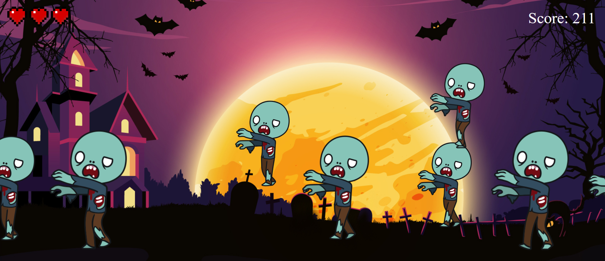

# Zombie Shooter

**Zombie Shooter** is a simple shooter game. Zombies are running (or levitating) on the screen and player's duty is to shoot them before they reach screen's left border. At first player has 3 lifes and 30 points. Every "living after screentime" zombie cost 1 life. Every good shoot is +10 points and every bad shoot is -3 points. When number of points drops below 0, player looses all remaining lifes and game ends.  
